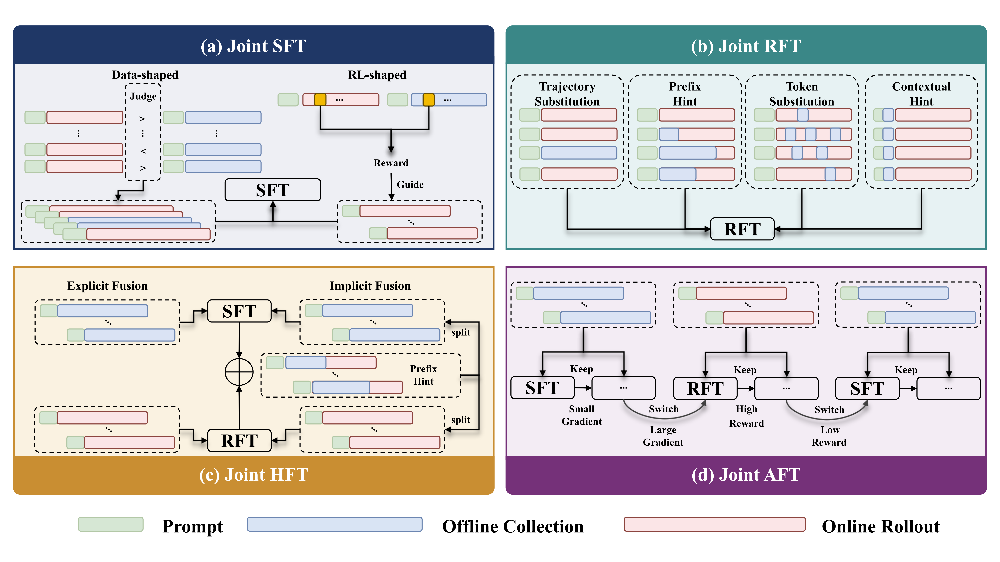

# Awesome Joint Online-Offline Fine-tuning

  
Joint online-offline fine-tuning studies how **offline expert priors** and **online policy rollouts** can be optimized together, rather than being isolated into the standard `SFT -> RFT` post-training pipeline. The central question is:

> How can offline stability and online adaptability be unified?

## News

- `2026-04`: Our survey was accepted to the **IJCAI 2026 Survey Track**.

## Contents

- [Taxonomy](#taxonomy)
- [Joint Online-Offline SFT](#joint-online-offline-sft)
- [Joint Online-Offline RFT](#joint-online-offline-rft)
- [Joint Online-Offline HFT](#joint-online-offline-hft)
- [Joint Online-Offline AFT](#joint-online-offline-aft)
- [Applications](#applications)

## Taxonomy

Our survey organizes the literature by **how offline and online data streams are coupled**, rather than by training stage alone.

| Family | Coupling mechanism | Best suited for |
| --- | --- | --- |
| Joint SFT | Online/self-generated signals reshape supervised fine-tuning data or token weights. | Sample quality control and middle/late-stage refinement. |
| Joint RFT | Offline demonstrations are injected into online rollout groups as trajectories, hints, tokens, or context. | Sparse-reward tasks with reliable demonstrations. |
| Joint HFT | SFT and RFT objectives are co-activated in a single training loop. | Balancing discontinuous supervised and reinforcement signals. |
| Joint AFT | SFT and RFT are adaptively scheduled using online training signals. | Heterogeneous data with varying difficulty and knowledge coverage. |

## Joint Online-Offline SFT

Joint SFT keeps the supervised learning interface but changes the construction or interpretation of supervision through online/self-generated signals.

### Data-Shaped SFT

| Method | Paper | Main idea | Objective | Datasets | Models |
| --- | --- | --- | --- | --- | --- |
| SDFT | Self-distillation bridges distribution gap in language model fine-tuning, ACL 2024 | Rewrites offline expert traces with model-generated distilled responses. | SFT | GSM8K, OpenFunction, Magicoder, LIMA | LLaMA2 |
| S3FT | Selective self-to-supervised fine-tuning for generalization in large language models, NAACL 2025 | Selectively replaces expert responses when self-generated responses are judged equivalent. | SFT | GSM8K, MBPP, NQ | Mistral-Instruct-v2 |
| JSFT | Aligning large language models by on-policy self-judgment, ACL 2024 | Uses the model as a judge to compare offline data and online rollouts for SFT. | SFT+DPO | Anthropic-HH, UltraFeedback | LLaMA2 |

### RL-Shaped SFT

| Method | Paper | Main idea | Objective | Datasets | Models |
| --- | --- | --- | --- | --- | --- |
| OTR | [One-Token Rollout: Guiding Supervised Fine-Tuning of LLMs with Policy Gradient](https://arxiv.org/abs/2509.26313) | Treats token generation as one-step RL and uses offline tokens as reward signals. | RL-shaped SFT | OpenR1-Math-220k | Qwen2.5, Qwen3 |
| SRL | [Supervised reinforcement learning: From expert trajectories to step-wise reasoning](https://arxiv.org/abs/2510.25992) | Provides smoother step-wise rewards based on similarity between model and expert actions. | Step-wise supervision | s1K-1.1 | Qwen2.5 |
| RFT / IRFT | Getting more juice out of the SFT data: Reward learning from human demonstration improves SFT for LLM alignment, NeurIPS 2024 | Learns rewards from demonstrations and contrasts them with model self-generations. | Reward learning | Anthropic-HH, Ultrachat200k | pythia, zephyr |

## Joint Online-Offline RFT

Joint RFT keeps online reinforcement fine-tuning as the main driver while inserting offline priors into the rollout process at different granularities.

### Trajectory Substitution

| Method | Paper | Main idea | Objective | Datasets | Models |
| --- | --- | --- | --- | --- | --- |
| LUFFY | [Learning to reason under off-policy guidance](https://arxiv.org/abs/2504.14945) | Substitutes part of each rollout group with expert/off-policy trajectories. | GRPO | OpenR1-Math-220k | Qwen2.5, LLaMA3.1 |
| RL-PLUS | [RL-PLUS: Countering capability boundary collapse of LLMs in reinforcement learning with hybrid-policy optimization](https://arxiv.org/abs/2508.00222) | Refines off-policy guidance with multiple importance sampling and exploration-based advantages. | GRPO | OpenR1-Math-220k | Qwen2.5, LLaMA3.1, DeepSeek-Math |
| AMPO | [More Than One Teacher: Adaptive Multi-Guidance Policy Optimization for Diverse Exploration](https://arxiv.org/abs/2510.02227) | Dynamically combines multiple expert teachers according to online reward signals. | GRPO | OpenR1-Math-46k-8192 | Qwen2.5, LLaMA3.2 |

### Prefix Hint

| Method | Paper | Main idea | Objective | Datasets | Models |
| --- | --- | --- | --- | --- | --- |
| Prefix-RFT | [Blending supervised and reinforcement fine-tuning with prefix sampling](https://arxiv.org/abs/2507.01679) | Conditions rollouts on partial expert prefixes and decays hint length during training. | GRPO | OpenR1-Math-220k | Qwen2.5, LLaMA3.1 |
| G2RPO-A | [G2RPO-A: Guided Group Relative Policy Optimization with Adaptive Guidance](https://arxiv.org/abs/2508.13023) | Adjusts guidance length and guided-trajectory count based on previous rewards. | GRPO | OpenR1-Math-220k, Verifiable-Coding-Problems-Python | Qwen3, DeepSeek-Math, DeepSeek-Code |
| BREAD | [BREAD: Branched rollouts from expert anchors bridge SFT and RL for reasoning](https://arxiv.org/abs/2506.17211) | Branches rollouts from expert anchors when self-generated traces fail. | GRPO | NuminaMath-CoT | Qwen2.5 |
| StepHint | [StepHint: Multi-level stepwise hints enhance reinforcement learning to reason](https://arxiv.org/abs/2507.02841) | Provides multi-level step-wise hints based on reasoning trajectory segmentation. | GRPO | DAPO-Math-17K, DeepMath | Qwen2.5 |

### Token Substitution

| Method | Paper | Main idea | Objective | Datasets | Models |
| --- | --- | --- | --- | --- | --- |
| MENTOR | Selective Expert Guidance for Effective and Diverse Exploration in Reinforcement Learning of LLMs, ICLR 2026 | Corrects selected tokens during rollout when the policy diverges from an expert distribution. | GRPO | MATH, OpenR1-Math-220k | Qwen2.5, LLaMA3.1 |

### Contextual Hint

| Method | Paper | Main idea | Objective | Datasets | Models |
| --- | --- | --- | --- | --- | --- |
| ICPO | [Think Outside the Policy: In-Context Steered Policy Optimization](https://arxiv.org/abs/2510.26519) | Uses offline expert responses as in-context examples to steer online policy optimization. | GRPO | OpenR1-Math-220k, Skywork-OR1-RL-Data | Qwen3 |

## Joint Online-Offline HFT

Joint HFT co-activates supervised and reinforcement objectives in the same training loop. The key challenge is learning or scheduling the balance between imitation and exploration.

### Explicit Fusion

| Method | Paper | Main idea | Objective | Datasets | Models |
| --- | --- | --- | --- | --- | --- |
| SuperRL | [SuperRL: Reinforcement learning with supervision to boost language model reasoning](https://arxiv.org/abs/2506.01096) | Uses reward-gated instance-level objective fusion between SFT and RL. | SFT+GRPO | GSM8K, MetaMath, PRM12K, LIMO, OpenR1 | Qwen2.5, LLaMA3.2 |
| AMFT | [AMFT: Aligning LLM Reasoners by Meta-Learning the Optimal Imitation-Exploration Balance](https://arxiv.org/abs/2508.06944) | Learns the SFT-RL balance with a meta-gradient controller. | SFT+GRPO | OpenR1-Math-46k-8192 | Qwen2.5-Math |
| BRIDGE | [Beyond two-stage training: Cooperative SFT and RL for LLM reasoning](https://arxiv.org/abs/2509.06948) | Formulates SFT as an upper-level controller that guides lower-level RL updates. | SFT+GRPO | LIMR, MATH | Qwen2, Qwen2.5, LLaMA3.2 |
| CHORD | On-Policy RL Meets Off-Policy Experts: Harmonizing Supervised Fine-Tuning and Reinforcement Learning via Dynamic Weighting, ICLR 2026 | Reframes SFT as a dynamically weighted auxiliary objective inside RL. | SFT+GRPO | OpenR1-Math-220k | Qwen2.5 |
| SRFT | [SRFT: A single-stage method with supervised and reinforcement fine-tuning for reasoning](https://arxiv.org/abs/2506.19767) | Uses offline data for both SFT and RFT with entropy-aware weighting. | SFT+GRPO | OpenR1-Math-46k-8192 | Qwen2.5-Math |

### Implicit Fusion

| Method | Paper | Main idea | Objective | Datasets | Models |
| --- | --- | --- | --- | --- | --- |
| UFT | [UFT: Unifying supervised and reinforcement fine-tuning](https://arxiv.org/abs/2505.16984) | Appends partial expert reasoning as hint prefixes and incorporates prefix likelihood into RL. | SFT+GRPO | Countdown, MATH, Logic | Qwen2.5, LLaMA3.2 |
| SEELE | [Staying in the Sweet Spot: Responsive Reasoning Evolution via Capability-Adaptive Hint Scaffolding](https://arxiv.org/abs/2509.06923) | Dynamically adjusts solution-prefix length to maintain suitable training difficulty. | SFT+GRPO | DeepMath-103K | Qwen2.5 |

## Joint Online-Offline AFT

Joint AFT treats SFT and RFT as complementary gradient sources and uses online training signals to decide when supervised intervention is needed.

| Method | Paper | Main idea | Objective | Datasets | Models |
| --- | --- | --- | --- | --- | --- |
| HPT | [Towards a unified view of large language model post-training](https://arxiv.org/abs/2509.04419) | Dynamically switches between offline SFT and online RFT using online reward feedback. | SFT+GRPO | OpenR1-Math-46k-8192 | Qwen2.5-Math, LLaMA3.1 |
| SASR | [Step-wise adaptive integration of supervised fine-tuning and reinforcement learning for task-specific LLMs](https://arxiv.org/abs/2505.13026) | Schedules SFT and RFT using gradient-level training indicators. | SFT+GRPO | GSM8K, MATH, KK | Qwen2.5, DeepSeek-R1-Distill-Qwen |

